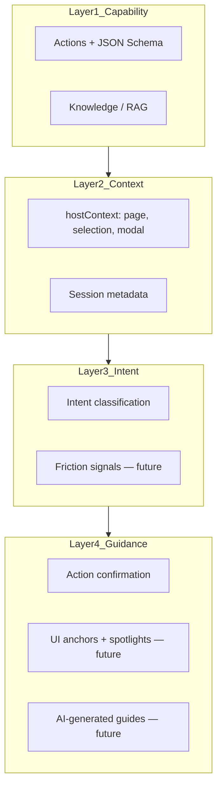

# Agent Capability Extension — Vision & Roadmap

> **Status:** Planning document — not implemented.
>
> This document describes how ActoCore could evolve toward an **Agent Capability Manifest** protocol: a way for web applications to expose what they can do to AI, so assistants understand intent rather than reverse-engineering the UI.

---

## Core insight

Most AI agents interacting with websites today have three problems:

1. They rely on **screenshots and DOM inspection**
2. They **break when the UI changes**
3. They don't understand **business meaning** ("Create a customer" vs. "Click the blue button")

A better model: the application publishes its **capabilities** in a machine-readable format. The AI understands what the app can do, not how buttons are styled.

ActoCore is already built on this principle. Actions are defined with `name`, `description`, and `inputSchema` — the AI maps natural language to intent, Core validates the payload, and the host app executes after user confirmation.

This document outlines how to extend that foundation into a fuller **four-layer protocol** and a unified **Agent Capability Manifest**.

---

## Positioning

ActoCore is not a generic browser agent that scrapes pages and guesses. It is an **in-app AI employee**:

- Declared once by developers (in Studio)
- Understood natively by the AI (via schemas and descriptions)
- Executed safely in the host app (confirm → run handler)
- Scoped per project (multi-tenant, allowlists, billing)

Think of the extension as:

**OpenAPI** (structured contracts) + **Accessibility** (semantic roles) + **Agent Actions** (executable capabilities)

---

## The four-layer model



| Layer | Question it answers | ActoCore today | Gap |
|-------|---------------------|----------------|-----|
| **1. Capability** | What can the application do? | Actions in Studio (`name`, `description`, `inputSchema`); RAG over knowledge; `GET /v1/sdk/actions` | Per-action risk metadata; unified manifest export |
| **2. Context** | What is happening right now? | `hostContext` typed in SDK but not sent to Core; session `metadata` on create only | `currentPage`, `selectedEntity`, `openModal`, `userRole` not in orchestration |
| **3. Intent** | What is the user trying to accomplish? | Heuristic + LLM action selection; multi-turn param collection | No friction detection; no proactive suggestions |
| **4. Guidance** | How should the AI interact with the user? | `ActionPendingCard` (confirm before run); action picker shortcuts; theme/i18n | No UI anchors, spotlights, or automated tours |

---

## What ActoCore already has

### Capability layer (strong)

Actions are the effective "tool manifest" today:

```typescript
// packages/shared/src/types/action.ts
interface ActionData {
  name: string;              // e.g. "add_member"
  description?: string;      // LLM-facing intent
  inputSchema: Record<string, unknown>;  // JSON Schema draft-07
  enabled: boolean;
  sectionId?: string;        // grouping via action sections
}
```

- Authored in **Studio**, stored in MongoDB
- Exposed at runtime via `GET /v1/sdk/actions`
- AI catalog built dynamically in `ActionSelectorService`
- Filtered by SDK config allowlists (`allowedActionNames`, `allowedSectionIds`)

### Q&A mode

Knowledge sources (text, URLs, PDF) power RAG answers. The AI can explain the product without executing anything.

### Safe execution model

```
User message
  → Core classifies intent (qa / action / direct)
  → ActionSelector picks action + extracts input
  → ActionRunner validates against inputSchema
  → Core returns status: "pending" (never runs host code)
  → SDK shows ActionPendingCard
  → User clicks Run
  → Host handler in ActocoreProvider executes
```

This is the right safety architecture. Extensions should add policy (risk levels, roles), not remove the confirmation gate for destructive work.

### Runtime discovery

`GET /v1/sdk/runtime` returns `apiVersion`, `features`, `projectId`, voice config, and merged SDK presentation config.

### Partial context hooks

- `ActocoreSecurityConfig.hostContext` — defined in SDK, **not forwarded to Core yet**
- Session `metadata` — optional bag on session create
- `externalUserId` — scopes sessions to host user
- Project `settings` (systemPrompt, rules, tone) — attached to request context in Core

### Key files (current implementation)

| Area | Path |
|------|------|
| Action types | `packages/shared/src/types/action.ts` |
| Action selection | `apps/backend/src/actions/action-selector.service.ts` |
| Validation (no execute) | `apps/backend/src/actions/action-runner.service.ts` |
| Orchestrator | `apps/backend/src/orchestrator/chat-orchestrator.service.ts` |
| SDK provider | `packages/sdk/src/provider/actocore-provider.tsx` |
| Confirmation UI | `packages/sdk/src/components/ActoChat/ActionPendingCard.tsx` |
| SDK config | `packages/shared/src/types/sdk-config.ts` |
| Product overview | `_docs/PROJECT.md` |

---

## Proposed: Agent Capability Manifest

A unified document describing everything an AI needs to understand and assist within an application.

### Example shape

```json
{
  "manifestVersion": "1.0",
  "app": {
    "name": "GymPro",
    "description": "Gym membership management"
  },
  "capabilities": {
    "qa": true,
    "actions": true,
    "guidance": false
  },
  "pages": [
    {
      "id": "members",
      "title": "Members Management",
      "route": "/members",
      "description": "View and manage gym members"
    }
  ],
  "actions": [
    {
      "id": "add_member",
      "description": "Create a gym member",
      "inputSchema": {
        "type": "object",
        "required": ["name", "email"],
        "properties": {
          "name": { "type": "string" },
          "email": { "type": "string", "format": "email" },
          "membershipType": { "type": "string", "enum": ["monthly", "6-month", "annual"] }
        }
      },
      "risk": "medium",
      "requiresConfirmation": true,
      "roles": ["staff", "admin"],
      "page": "members"
    }
  ],
  "anchors": [
    {
      "id": "add-member-button",
      "selector": "#add-member",
      "semanticRole": "create-member",
      "page": "members",
      "label": "Add Member"
    }
  ],
  "guidance": {
    "canHighlight": true,
    "canAnimate": true,
    "canFillForms": true,
    "canExecuteActions": true
  }
}
```

### Hosted vs. static manifest

Some proposals suggest a static file on every site:

```
/.well-known/agent-manifest.json
/agent-manifest.json
```

**For ActoCore, the source of truth should remain hosted in Core:**

- Integrates with Studio authoring, versioning, and audit
- Respects per-project allowlists and billing
- Same API key auth as the rest of the SDK surface
- Proposed delivery: `GET /v1/sdk/manifest` (or an extension of `/v1/sdk/runtime`)

**Optional later:** export manifest JSON from Studio for documentation, CI validation, or interoperability with external agents. Export is a feature, not the runtime contract.

### Host context (runtime, not in manifest)

Context is **live state** sent with each chat message, not static config:

```typescript
interface HostContext {
  currentPage?: string;           // matches pages[].id
  route?: string;                 // e.g. "/members/42"
  selectedEntity?: {
    type: string;                 // e.g. "member"
    id: string;
    label?: string;
  } | null;
  openModal?: string | null;      // e.g. "add_member"
  userRole?: string;              // host-app role, not Studio RBAC
  custom?: Record<string, unknown>;
}
```

The SDK already declares `hostContext` on `ActocoreSecurityConfig`; the extension wires it into `SendChatMessageDto` and the orchestrator system prompt.

---

## Phased extension roadmap

### Phase 1 — Context layer (foundation)

**Goal:** The AI knows where the user is and what they are looking at.

| Item | Description |
|------|-------------|
| Wire `hostContext` | SDK sends context on each chat message to Core |
| Orchestrator integration | Inject context into system prompt and action selection |
| Studio docs | Document recommended `hostContext` fields for integrators |
| Playground demo | sdk-playground reports fake page/selection for testing |

**Unlocks:** "Add a member" when already on the members page skips unnecessary navigation hints; action selection can prefer page-relevant actions.

**Depends on:** Nothing — highest leverage, smallest scope.

---

### Phase 2 — Safety metadata & manifest endpoint

**Goal:** Per-action policy and a single discovery document for developers and AI.

| Item | Description |
|------|-------------|
| `riskLevel` on actions | `low` / `medium` / `high` — e.g. delete = high |
| `requiresConfirmation` | Default `true`; `false` only for safe read-only actions |
| `roles` (optional) | Host-app roles allowed to run this action; enforced in SDK before handler |
| `GET /v1/sdk/manifest` | Unified manifest combining actions, pages (if any), capability flags |
| Studio UI | Edit risk/confirmation/roles alongside action schema |
| Confirmation UX | High-risk actions: stronger UI (e.g. type-to-confirm, show impact summary) |

**Unlocks:** "Delete all inactive members" triggers explicit high-risk flow, not silent execution.

**Depends on:** Phase 1 optional but recommended for role-aware context.

---

### Phase 3 — Pages & navigation model

**Goal:** The AI understands app structure without DOM scraping.

| Item | Description |
|------|-------------|
| `pages[]` in manifest | `id`, `title`, `route`, `description` |
| Studio authoring | Define pages; link actions to pages |
| AI behavior | Explain where things live; suggest navigation in natural language |
| `hostContext.currentPage` | Must match `pages[].id` for consistent reasoning |

**Unlocks:** "How do I add a member?" → "You're on Settings; go to Members, then I can add one for you" — or execute directly if handler supports it.

**Depends on:** Phase 1 (context), Phase 2 (manifest endpoint).

---

### Phase 4 — Guidance primitives (SDK)

**Goal:** AI-generated spotlights, tours, and click demonstrations — WalkMe-like, but driven by manifest + AI.

| Item | Description |
|------|-------------|
| `anchors[]` in manifest | `id`, `selector`, `semanticRole`, `page`, `label` |
| SDK overlay module | Spotlight/highlight component targeting anchors |
| Guide generation | AI produces step sequences: highlight anchor → explain → optional action |
| `guidance` permissions | `canHighlight`, `canAnimate`, `canFillForms`, `canExecuteActions` |
| Anchor source | **Open decision:** Studio-authored vs. host-declared in SDK props |

**Design principle:** Anchors are an **optional Guidance extension**. Actions remain semantic (`add_member`), not selector-based (`#btn-123`). UI changes break selectors; action names do not.

**Unlocks:** Onboarding tours, contextual help, "watch me do it" demonstrations generated from a prompt.

**Depends on:** Phase 1 (know current page), Phase 3 (pages), Phase 2 (manifest).

---

### Phase 5 — Proactive AI UX (long-term)

**Goal:** The assistant notices struggle and offers help before being asked.

| Signal (examples) | Possible response |
|-------------------|-------------------|
| Repeated clicks on same element | "Having trouble with checkout?" |
| Long hesitation on a form | "Want me to fill this from your last invoice?" |
| Form validation failures | "The email format looks wrong — want me to fix it?" |
| Same search repeated | "Looking for recurring invoices? I can filter those." |
| Rage-clicking | Escalate to guided walkthrough |

| Item | Description |
|------|-------------|
| Friction telemetry API | SDK opt-in event stream (privacy-first, documented) |
| Intent inference | Combine friction + context + manifest → `possibleGoals[]` with confidence |
| Proactive nudges | Non-intrusive suggestions in chat or subtle UI prompt |
| Consent & settings | Host app and end-user controls for proactive behavior |

**Unlocks:** The "AI UX layer" vision — software that knows when users are stuck.

**Depends on:** Phase 1–4; significant product and privacy design.

---

## What we should not build

| Anti-pattern | Why |
|--------------|-----|
| DOM selectors as the primary action contract | Brittle; defeats the purpose of semantic capabilities |
| Autonomous execution of destructive actions | Confirm-then-run is correct; add policy, don't remove the gate |
| Competing with screenshot/DOM agents | Different product; ActoCore wins on native understanding |
| Open standard (`/.well-known/...`) as v1 | Ship hosted manifest first; standardize export when there are adopters |
| WalkMe-style tours before context | Without Layer 2, highlights and guides are blind |
| Core executing host application code | Unchanged principle: Core validates; host runs handlers |

---

## Open questions (deferred)

| Question | Options |
|----------|---------|
| Manifest versioning | Semver on `manifestVersion`; breaking changes in major bumps |
| Anchor authoring | Studio-only, SDK-only, or hybrid (Studio for docs, SDK for live DOM) |
| Role enforcement | SDK-only vs. Core also filtering actions by `hostContext.userRole` |
| Friction telemetry | What to collect, retention, GDPR, opt-in UX |
| Execution feedback | Should SDK report action success/failure back to Core sessions? |
| Relationship to MCP | Complementary? ActoCore manifest as MCP tool source? |
| Public spec | Publish manifest schema as open doc for non-ActoCore adopters? |

---

## Success criteria (when implemented)

- [ ] Developer declares actions once in Studio; UI refactors do not break AI understanding of intent
- [ ] AI receives live page/selection context and gives relevant answers without "click the blue button"
- [ ] High-risk actions have visibly stronger confirmation than low-risk reads
- [ ] Manifest is discoverable via one SDK endpoint and documentable via Studio export
- [ ] Optional guides use semantic anchors + actions, not ad-hoc DOM trial-and-error
- [ ] Proactive help (if built) is opt-in and respects user and host privacy choices

---

## Relationship to current product docs

| Document | Scope |
|----------|-------|
| [`_docs/PROJECT.md`](../PROJECT.md) | What ActoCore is today |
| [`_docs/studio/assistant/sdk-actions-and-security.md`](../studio/assistant/sdk-actions-and-security.md) | Current action + allowlist integration |
| [`ROADMAP.md`](../../ROADMAP.md) | Shipped and in-progress engineering tasks |
| **This document** | Long-term extension vision — Agent Capability Manifest |

When a phase moves from vision to engineering, add concrete checklist items to `ROADMAP.md` and update this doc's status.

---

## Summary

The Agent Capability Manifest is not a pivot for ActoCore — it is a **name and structure for what you are already building**, extended across four layers:

1. **Capability** — largely done (actions + knowledge)
2. **Context** — wire `hostContext` next
3. **Intent** — improve selection; add friction later
4. **Guidance** — anchors, spotlights, tours as optional SDK layer

ActoCore's moat: applications publish what they can do; the AI behaves like a knowledgeable insider, not a robot clicking through the DOM.
